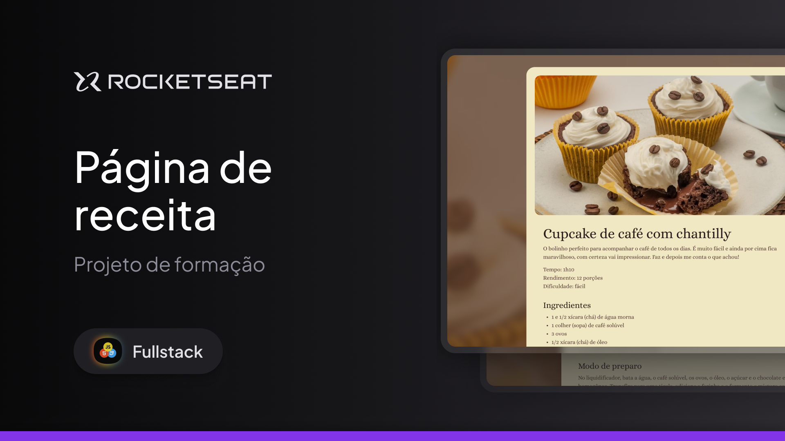

  

  
  

## 💻 Projeto

Esse projeto foi desenvolvido durante as aulas da formação Full-Stack na Rocketseat.

    

## 📘 Conceitos Aprendidos

- Estrutura de arquivo HTML
- Atributos HTML
- Cores em HTML
- Principais elementos do HTML

- Fundamentos de CSS
- Box Model
- Estilizar textos
- adicionar cores e backgrounds

- Conceitos iniciais de Git e Github

## 🧑‍💻 Tecnologias

- HTML
- CSS
- Figma
